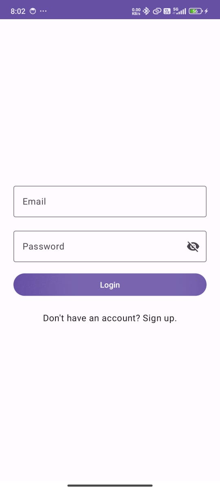
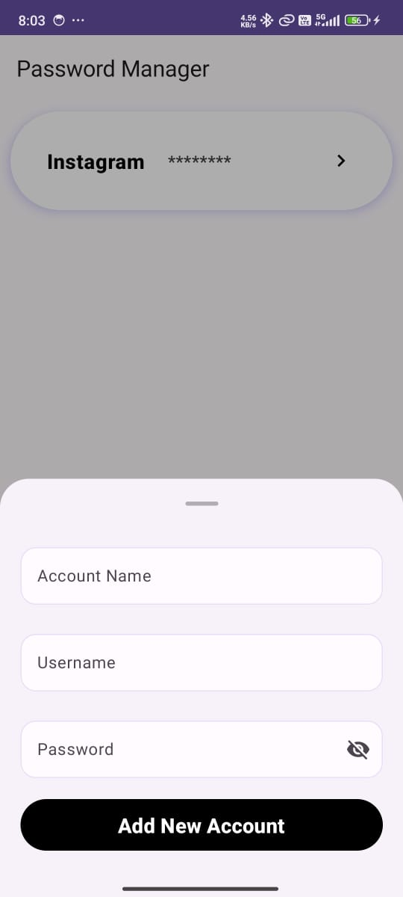
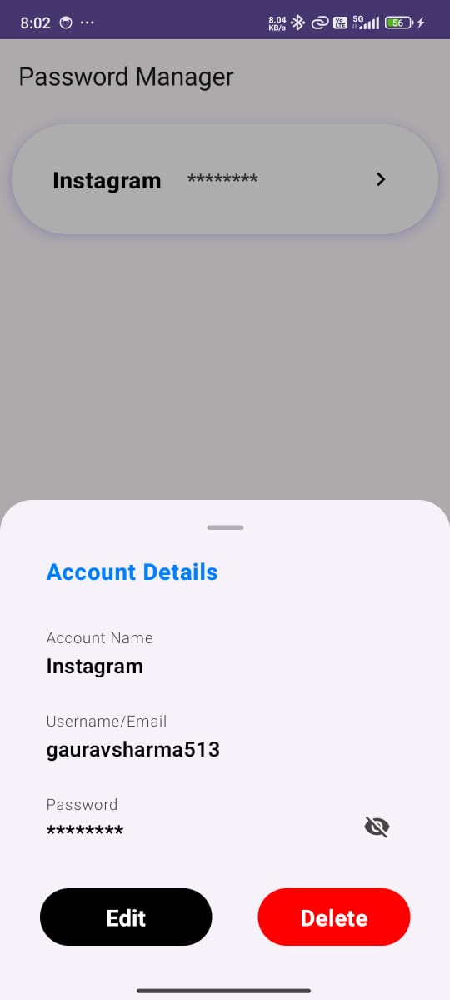
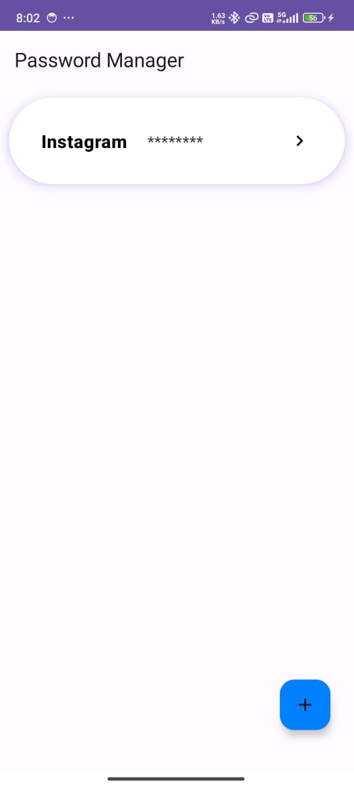

# Password Manager Application Documentation

## Building the Application:

### Clone the Repository:
1. Open Android Studio.
2. Select **File > New > Project from Version Control**.
3. In the "URL" field, paste the repository URL: 
4. Choose the directory where you want to clone the repository.
5. Click on **Clone**.

### Open Project in Android Studio:
1. Once the cloning process is complete, the project will open automatically. 
2. If not, open the project by selecting **File > Open** and navigating to the cloned project directory.
3. Android Studio will load the project and index its contents. This process may take a few minutes depending on your system's performance.

### Sync Gradle and Build Project:
1. Android Studio will automatically sync the project with Gradle.
2. Wait for the sync to complete successfully.
3. This will compile the project and generate the necessary build artifacts.

---

## Running the Application:

### Connect Device or Emulator:
- Connect an Android device via USB or launch an emulator from Android Studio.
- Ensure that the device or emulator is running a compatible version of Android (API level 30 or higher).

### Build and Run:
1. Click on the **green play button** (Run) in Android Studio toolbar, or select **Run > Run 'app'** from the menu.
2. Select the target device or emulator where you want to deploy the application.
3. Android Studio will install the application on the selected device or emulator and launch it automatically.

### Explore the Application:
Once the application is installed and running, explore its features and user interface.

---

## Using the Application:

### Features:

#### Sign Up:
- On the first launch, you will be prompted with the **Sign Up** screen.
- Enter your **username**, **email**, and create a **master password**.
- Tap on **"Sign Up"** to create a new account.
- The master password will be used for future logins and encrypting your stored passwords.

##### **Screenshot:**

#### Sign In:
- After registering, you will be redirected to the **Sign In** screen.
- Enter your **email** and **master password**.
- Tap on **"Sign In"** to access your saved passwords.

##### **Screenshot:**

---

### Adding Passwords:
- Tap on the `+` floating button.
- Enter the account type (e.g., Gmail, Facebook), your username/email, and the password.
- Tap on **"Add New Account"** to securely store the password.

##### **Screenshot:**

---

### Viewing and Editing Passwords:
- View and edit existing passwords by selecting the password you want to edit from the home screen section.
- Tap on the **"Edit"** button to change necessary details.
- Save your edits by tapping on the **"Confirm"** button.

##### **Screenshot:**

---

### Deleting Passwords:
- View and delete existing passwords by selecting the password you want to remove from the home screen.
- Tap on the **"Delete"** button to remove the password.

##### **Screenshot:**

---

## Room Database:
- Our application utilizes a secure **Room database** to manage encrypted passwords locally on your device.
- Room is an Android persistence library that provides an abstraction layer over SQLite, making it easier to manage and access encrypted data.
- The use of Room ensures efficient and reliable storage of passwords, with built-in features such as data validation and query optimization.

---

## Intuitive User Interface:
- Our app features a clean and intuitive user interface, designed to make password management effortless.
- The user interface is thoughtfully crafted with a minimalist design, focusing on ease of use and clarity of information.
- Features such as clear labeling, intuitive icons, and logical layout contribute to the overall usability of the app.
- Whether you're adding a new password, editing an existing one, or generating a strong password, the user interface guides you through each step with minimal effort.

---

## Tech Stack:
Our Password Manager application is built using the following technologies:
- **Kotlin**: The app is developed primarily using Kotlin, a modern programming language for Android development known for its conciseness and safety features.
- **Jetpack Compose**: We leverage Jetpack Compose, Google's modern toolkit for building native Android UIs, to create dynamic and responsive user interfaces.
- **Room Database**: For secure and efficient data storage, we utilize Room, an Android persistence library that provides an abstraction layer over SQLite, ensuring reliable management of encrypted passwords.
- **Material Design**: The app adheres to Google's Material Design guidelines, ensuring a consistent and visually appealing user experience across different Android devices and versions.

---

## Application Screenshots:
Here are the complete screenshots of the application:
- **Sign Up**

- **Sign In**

- **Home Screen**

- **Add Accounts**

- **Edit Username and Password**

- **Delete Username and Password**

---

